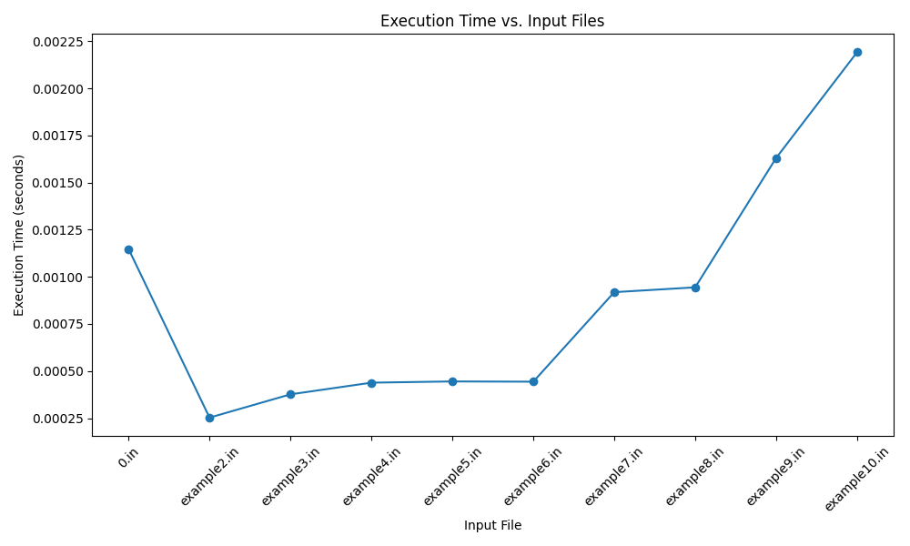

# UFID and Student Names
Name: Hong Ouyang | UFID: 54798985
<br/>
Name: Jack Stone | UFID: 22490590

# Instructions for Running the Algorithms
1. Clone the repo into an IDE that runs C++ (and Python if running Benchmark.py).

2. If applicable, add your input file into `/tests/input/`.

3. In the terminal, cd to the `src` file.

4. Run the program either by typing in `python main.py` or pressing the Run button in the main file of your IDE.

5. When the file is running, it prompts you to input a file from `/tests/input/`, type the file you want to test for misses.
    - When inputting in the file ensure:
        - You do not input any folders such as `/tests/input/` unless if your input file is in a folder in `input/`.
        - Your input file has its extention name, which would be `.in`.
        - The file is formatted correctly.
    - An example would be typing in `example1.in`.

6. After inputting the input file you will be prompted to provide a output file.
    - When inputting the file, ensure:
        - You do not input any folders such as `/tests/output/` unless if you wish for your output file to be in a folder in `/tests/output/`.
        - Your output file has its extention name, which would be `.out`.
        - The output file does not have to be an existing one.
    - Naming the output to have the same name as an existing file will replace that existing file.
    - An example would be typing in `example1.out`.

7. Following these steps, your output file will appear in `tests/output/`.

Note: If you want to check multiple files and create a graph, under benchmark.py, in the `input_files` list, edit the files to be the files you want, like the files already in the list (Requires matplotlib).

# Assumptions
The code assumes that the input file has a viable .in file name that will follow the format layed out in the assignment, being:

```
K
x1 v1
x2 v2
...
xK vK
A
B
```

Where:
- K is the number of characters in the alphabet.
- Each of the next K lines contains a character and its value.
- A is the first string.
- B is the second string.

</br>

We also assume that the inputted output file has a viable .out file name that follows the format:

```
<Maximum value>
<Optimal Subsequence>
```

We also assume that for creating the graph in benchmark.py, you have matplotlib

</br>

# Questions
## Question 1

In this graph, example 1 has 25 characters, example 2 has 30 characters, example 3 has 50 characters, example 4 has 60 characters, example 5 has 70 characters, example 6 has 80 characters, example 7 has 90 characters, example 8 has 110 characters, example 9 has 150 characters, and example 10 has 180 characters.

## Question 2
$$
OPT(i, j) = 
\begin{cases} 
0 & \text{if } i = 0 \text{ or } j = 0 \\
max\{OPT(i−1, j), OPT(i, j−1)\} & \text{if } a_i \neq b_j \\
max\{OPT(i-1, j), OPT(i, j-1), OPT(i-1,j-1)+w(a_i)\} & \text{if } a_i = b_j
\end{cases}
$$

The recurrence equation is correct because if, for example, we have the characters $a_i$ and $b_j$ in A and B:

If we have the case where $a_i$ $\neq$ $b_j$, they can't be part of a common subsequence, so the optimal solution must either have the max value of either $a_i$ or $b_j$ while excluding the other.

If we have the case where $a_i$ = $b_j$, we would match the character with the previous characters OPT(i-i, j-1), and add the value of it to the previous until $a_i$ $\neq$ $b_j$ and save the max value.

Thus, we consider all possibilities (excluding from either string or including the match) and take the maximum, ensuring the optimal solution is found.

## Question 3
```
HVLCS-Length(A, B, weight):
    n = length(A)
    m = length(B)

    create table DP[0..n][0..m]

    // base cases
    for i = 0 to n:
        DP[i][0] = 0
    for j = 0 to m:
        DP[0][j] = 0

    // recursive calls
    for i = 1 to n:
        for j = 1 to m:
            DP[i][j] = max(DP[i-1][j], DP[i][j-1])

            if A[i] == B[j]:
                DP[i][j] = max(
                    DP[i][j], DP[i-1][j-1] + weight[A[i]]
                )

    return DP[n][m]
```

The runtime of the algorithm is O(n*m)